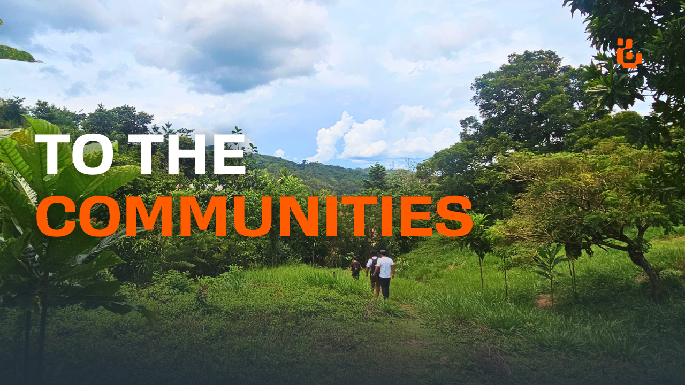

## 
¡WELCOME TO <b>IDENTI</b>! 🖐️🌎

  
  
  
  

### OUR MISSION
---
Develop an open, voice-based system that validates people's identities and facilitates secure transactions.

### WHAT DO WE DO?
---

<table style="border-collapse: separate; border-spacing: 0 4px; width: 100%;">
  <tr style="border: 1px solid #ccc;">
    <td style="padding: 10px; vertical-align: top;">
       
      We offer a digital wallet that can only be accessed using your voice (biometrics). 
      It allows you to identify yourself, register, store, and exchange information. 
        
      In addition, through this wallet, you can request services without passwords, 
      endless paperwork, or expensive devices.
    </td>
    <td style="padding: 10px; vertical-align: top;">
       
      We provide a reliable channel for interacting with and offering services to 
      non-digitized communities. This allows us to reduce barriers and accelerate 
      financial and social inclusion.
    </td>
  </tr>
</table>

### OUR VALUE PROPOSITION
<table>
  <tr>
    <td></td>
    <td></td>
    <td></td>
  </tr>
  <tr style="text-align: center; font-weight: bold;">
    <td>Simple for the end user</td>
    <td>Inclusive for communities</td>
    <td>Reliable for organizations</td>
  </tr>
  <tr>
    <td>Solutions so intuitive that all it takes is a voice to open the door to the digital world.</td>
    <td>More digital identities, more inclusion, and more trust in communities that were previously disconnected.</td>
    <td>Robust and secure technology that guarantees identity and access, with a flexible and transparent service model.</td>
  </tr>
</table>

